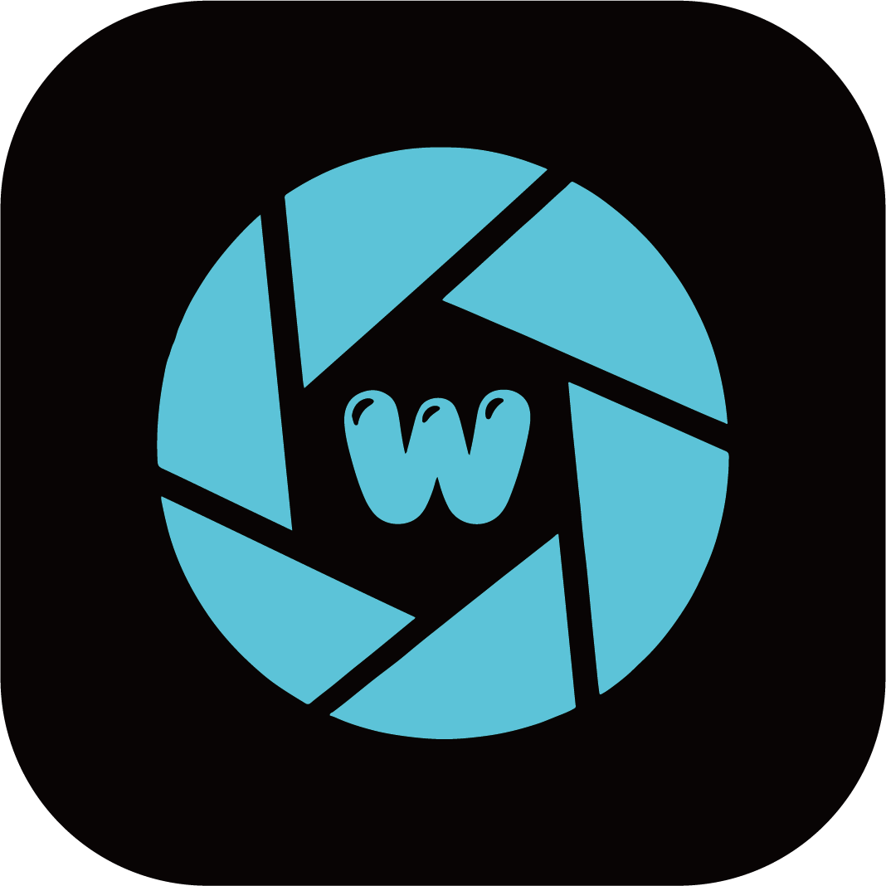
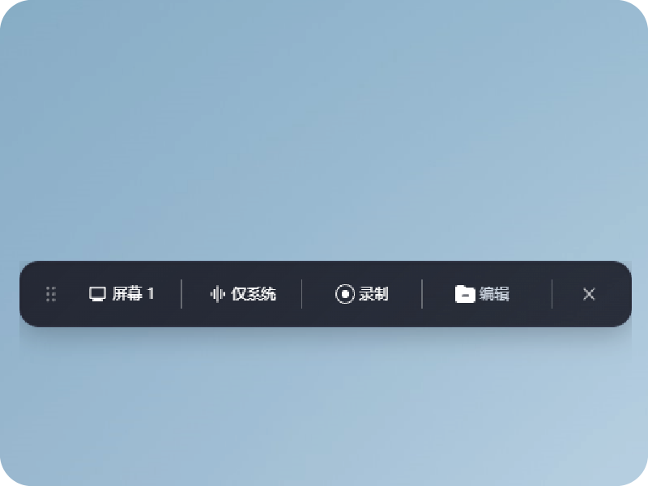
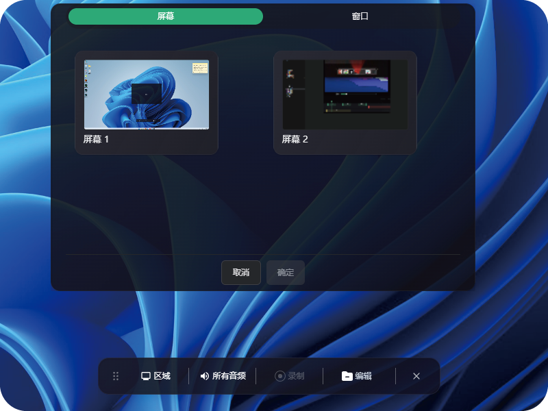
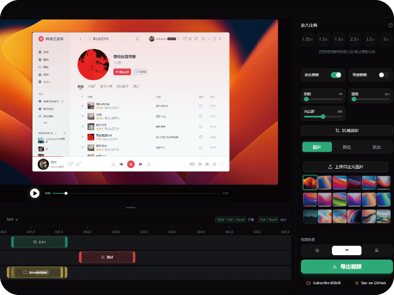
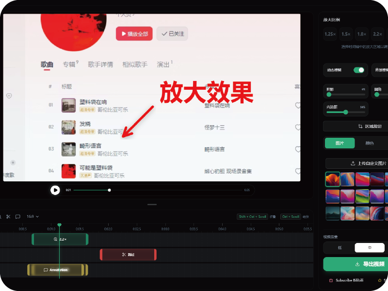

  

# 
OpenScreenW

  <strong>基于 OpenScreen的汉化版本；优化部分功能</strong>
  

## 优化
- 增加音频采集（系统/麦克风/所有/无）
- delete快捷键操作
- 窗口操作行为
- 托盘操作行为
- 预览窗内注释拖拽性能
- 安装包体积

## 核心功能
- 录制整个屏幕或指定应用
- 添加手动缩放（支持自定义缩放深度）
- 自由调整缩放的持续时间和位置
- 裁剪视频以隐藏不需要的区域
- 背景可选择壁纸、纯色、渐变或自定义图片
- 动态模糊效果，使平移和缩放更加顺滑
- 添加注释（文本、箭头、图片）
- 剪辑视频片段
- 导出不同的画面比例和分辨率

	
	
	
	

